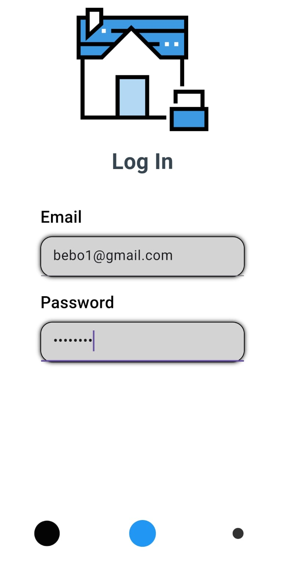
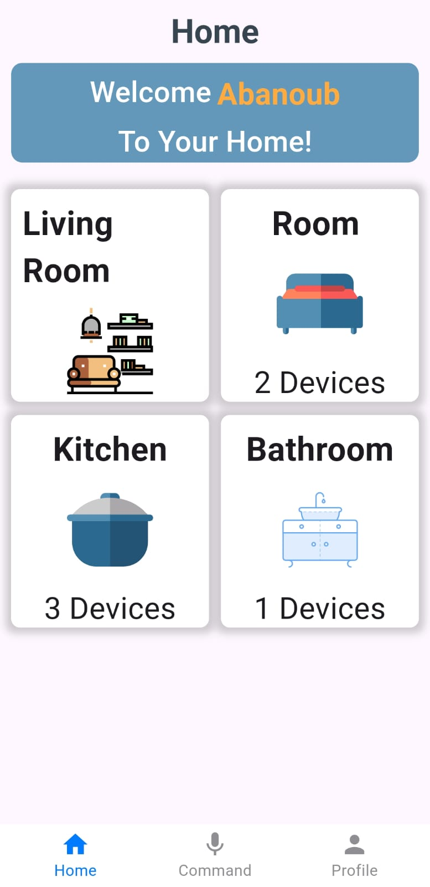
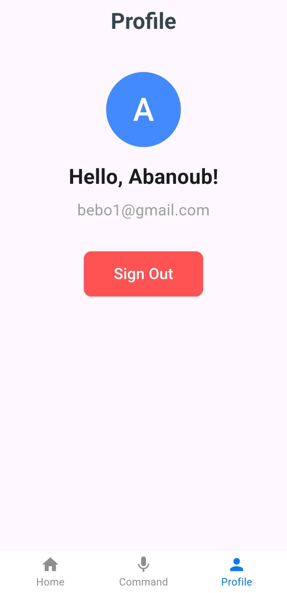
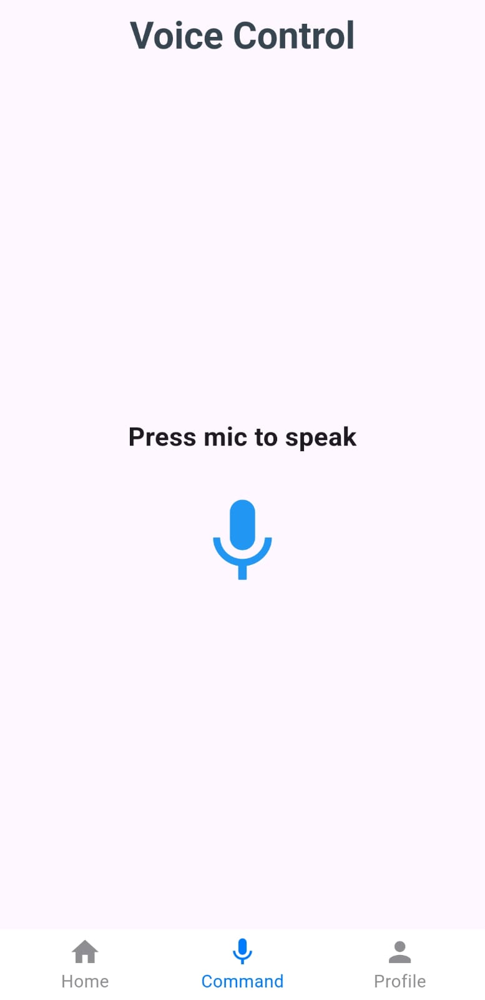
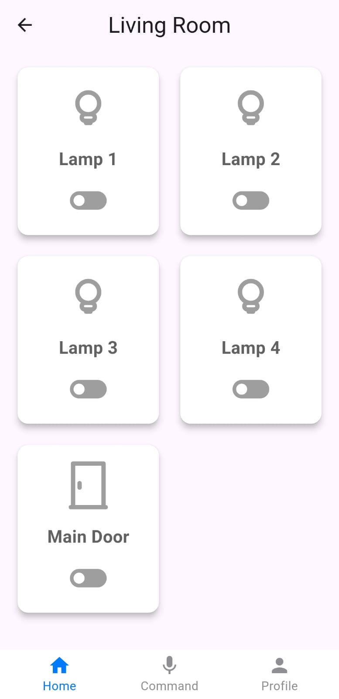
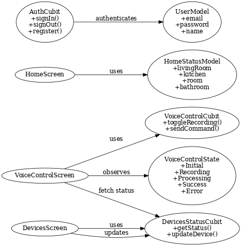

# 🏠 Voice Control Smart Home - Flutter Application

A smart home mobile app that allows users to control home devices using voice commands in both English and Arabic. The system integrates AI-powered speech recognition, IoT microcontrollers, and real-time communication.

---

## 📱 Features

- 🎙️ Voice Control (Whisper AI)
- 🔌 Real-time Device Control (ESP32)
- 🌡️ Sensor Monitoring (Temperature, Humidity, Light)
- 🔐 Firebase Authentication
- 🌐 HTTP + WebSocket Communication
- 📦 Flutter Bloc (Cubit) State Management
- 🌍 Multi-language support (EN/AR)

---

## ⚙️ Tech Stack

| Layer | Technologies |
|-------|--------------|
| Mobile App | Flutter (Dart) |
| Backend | Python Flask |
| AI | OpenAI Whisper |
| Microcontroller | ESP32 |
| Communication | HTTP & WebSocket |
| Authentication | Firebase |
| State Management | Bloc (Cubit) |

---

## 🧠 Architecture Overview

- The mobile app captures user voice commands.
- Audio is sent to the Flask backend for processing.
- Whisper AI converts speech-to-text.
- Commands are parsed and sent to ESP32.
- ESP32 executes the command and sends back status updates in real-time via WebSocket.

---

## 📡 Data Flow

```plaintext
User → Mobile App → Flask Backend → Whisper AI → ESP32 → WebSocket Updates → Mobile App
```

---

## 🚀 Future Improvements

- ✅ Fingerprint Authentication for sensitive actions.
- ✅ Full user settings and scheduling automation.
- ✅ More advanced device grouping.

---

## 📸 Demo
UI Screenshots ✅





Emulator Video Demo ✅

Real Device Control Demo ✅


- Emulator Video Demo 🎞️

- Real Device Control  🎞️

- UML Class Diagram 🖼️


---

## 🛠️ How to Run

> This project is currently private but available upon request.
🔧 1️⃣ Clone the repository
bash
Copy
Edit
git clone https://github.com/your-username/your-repo-name.git
cd your-repo-name
🔧 2️⃣ Setup Flutter App
Make sure Flutter SDK is installed:

bash
Copy
Edit
flutter --version
Get dependencies:

bash
Copy
Edit
flutter pub get
Run on emulator or device:

bash
Copy
Edit
flutter run
🔧 3️⃣ Configure Backend Server
Backend written in Python (Flask).

Install requirements:

bash
Copy
Edit
cd backend/
pip install -r requirements.txt
Make sure Whisper model is downloaded properly (since it's large).

Start Flask server:

bash
Copy
Edit
python app.py
🔧 4️⃣ ESP32 Setup
Flash the ESP32 firmware to handle device control.

Ensure ESP32 is connected via WebSocket + HTTP to match mobile & backend.

🔧 5️⃣ Firebase Setup
Create Firebase project.

Enable Authentication → Email/Password.

Download google-services.json and place inside:

bash
Copy
Edit
/android/app/google-services.json
⚠ Notes:
Make sure both Mobile & Backend & ESP32 are running on the same network (for real device demo).

WebSocket IP & HTTP URLs should be correctly configured in code.


---

## 🔗 Contact

- LinkedIn:[(https://www.linkedin.com/public-profile/settings)]
- Email: [steven.antonios445@gmail.com]

---

## 🔐 License

This project is for educational and portfolio purposes.
